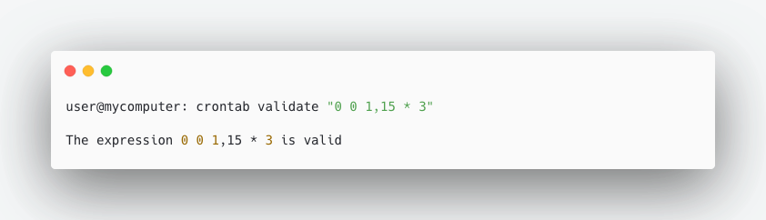
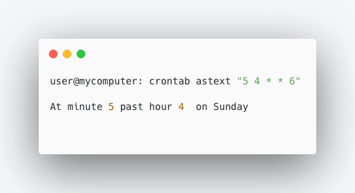
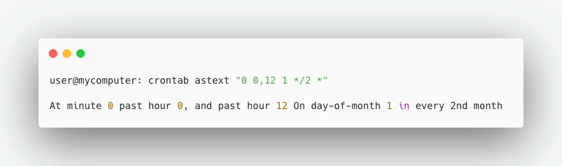

# Crontab parser

Simple crontab parser written in Rust

# Validating cron expression

# Text representation of the cron

Or more complex expression:

# Features

- Validates a cron expression
- Translate a text expression into words
- Displays future execution time of the task (WIP)
- Take a a sentence in the form "Execute a task []" and build up a cron expression with it (WIP)